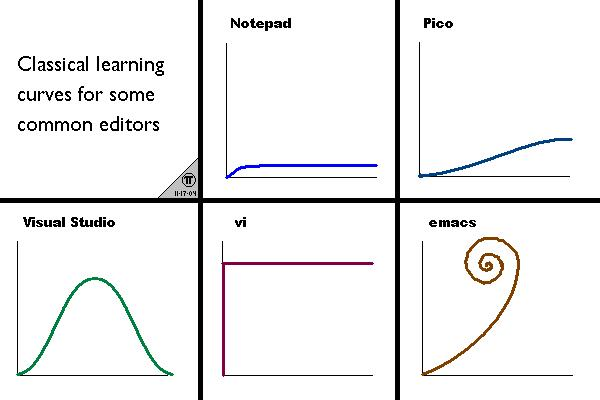

- TODO This is my first block
  SCHEDULED: <2023-11-11 Sat>
  :LOGBOOK:
  CLOCK: [2023-11-10 Fri 23:57:35]--[2023-11-10 Fri 23:57:36] =>  00:00:01
  CLOCK: [2023-11-11 Sat 00:01:53]--[2023-11-11 Sat 00:01:58] =>  00:00:05
  CLOCK: [2023-11-11 Sat 00:02:03]--[2023-11-11 Sat 00:02:09] =>  00:00:06
  CLOCK: [2023-11-11 Sat 00:02:10]--[2023-11-11 Sat 00:02:57] =>  00:00:47
  CLOCK: [2023-11-11 Sat 00:02:58]--[2023-11-11 Sat 00:02:59] =>  00:00:01
  CLOCK: [2023-11-11 Sat 00:03:01]--[2023-11-11 Sat 00:03:02] =>  00:00:01
  CLOCK: [2023-11-11 Sat 00:03:03]--[2023-11-11 Sat 00:22:58] =>  00:19:55
  CLOCK: [2023-11-11 Sat 00:23:40]--[2023-11-11 Sat 00:23:46] =>  00:00:06
  CLOCK: [2023-11-11 Sat 00:23:50]--[2023-11-11 Sat 00:23:50] =>  00:00:00
  CLOCK: [2023-11-11 Sat 00:23:53]--[2023-11-11 Sat 00:23:53] =>  00:00:00
  :END:
- [[Things]] to do:
	- Eat #[[research workflows]]
	- Sleep
	- [[Grocery]]
		- beurre
		- Sauce
- This is my second block
- Things to do:
  collapsed:: true
	- Eat
	- Sleep
	- BAYA
		- beurre
		- Sauce
-
-
-
- 
-
- https://www.assemblyai.com/blog/how-to-run-openais-whisper-speech-recognition-model/#openai-whisper-analysis
- https://www.assemblyai.com/
- https://discuss.logseq.com/t/graphical-explanation-of-pages-blocks-and-references/15966
- https://www.colemak.academy/
- #LearningResources [[Linking Your Thinking Benefits]](https://www.linkingyourthinking.com/)
- https://aryansawhney.com/pages/the-ultimate-guide-to-aliases-in-logseq/
-
- https://miro.medium.com/v2/resize:fit:4800/format:webp/0*IUG4AhjJRfVfZyJg.png
-
-
-
-
- 
- 
- TODO Find Keyboard keeper alternative
  :LOGBOOK:
  CLOCK: [2023-11-10 Fri 23:53:29]--[2023-11-10 Fri 23:53:30] =>  00:00:01
  :END:
- TODO Create a GPTs to generate the perfect prompts
-
-
-
-