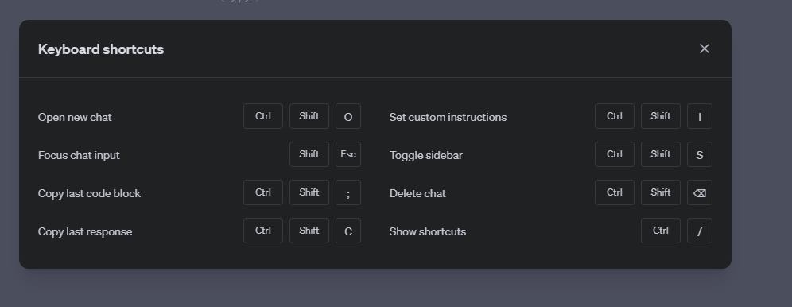

- DONE Find a solution for the [[keyboard]] [[layout]]
  collapsed:: true
  :LOGBOOK:
  CLOCK: [2023-11-11 Sat 03:31:05]--[2023-11-11 Sat 03:31:22] =>  00:00:17
  CLOCK: [2023-11-11 Sat 03:31:27]--[2023-11-11 Sat 03:31:27] =>  00:00:00
  :END:
	- To enable the arrows on the right side of the Ducky keyboard:
		- [[DIP switches]] under keyboard are all off
		- [[AutoHotKey]] script [Arrows.ahk](../assets/Arrows_1699693175582_0.ahk) in shell:startup
		- Use [[PowerToys]] [[keyboard]] manager to assign VK223 to right arrow
			-
			-
			-
		-
		-
		-
- TODO Find a solution for windows snapping
- https://www.producthunt.com/products/stage-light
- https://kcaps.app/
- https://keyboardchecker.com/
- TODO Find a solution to assign Media keybinds (Pause,Play,etc.)
- TODO Establish [[shortcuts]] library
	- 
- TODO Find a way to extend the behavior of Win + Arrow keyss
- TODO Remove US keyboard layout
- TODO Keyboard shortcut to implement: Alt + F4, Forward Slash
- TODO Find chorded keybinds creation software
- TODO Create a custom [[GPTs]] for [[prompt]] creation & optimization, to gather data and build a mini database
	- Build a text file with conditional scenario of prompting usage and pointing to specific link for deeper understanding.
	- Use AutoGPT to test the efficiency of the text file?
	-
- 
-
-